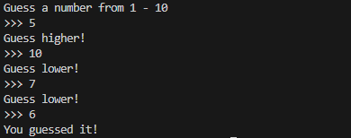

# Random Number Game

Enter your guess for a number, and the code will determine whether it matches the random number or not. 

Your guess will be the winning number.

However, you'll be told to guess higher if your guess is less than the random number.

but you'll be told to guess lower if your guess is higher than the random number.

